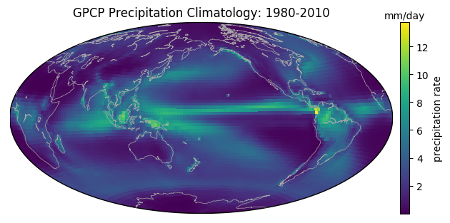

# geoplots: customized python plots for geoscience

### Get Started

    from geoplots import geoplot
    import xarray as xr
    import matplotlib.pyplot as plt
  
    da = xr.open_dataarray('http://iridl.ldeo.columbia.edu/SOURCES/.NASA/.GPCP/.V2p2/.satellite-gauge/.prcp/T(Jan%201980)(Dec%202010)RANGE%2[T]average/dods')
    geoplot(da)
    plt.title('GPCP Precipitation Climatology: 1980-2010')

### Examples

1. [Create a basemap](examples/create_basemap.ipynb)
